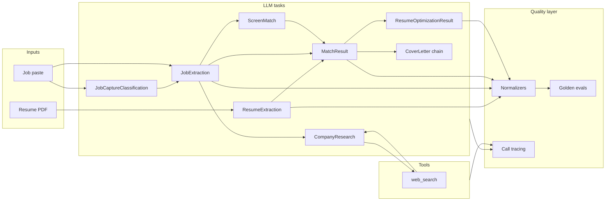

# AI Engineering

How this project applies production AI patterns — structured outputs, evals, observability, and human-in-the-loop design — without agent-framework complexity.

## Design principles

1. **Measure before adding architecture** — golden evals for every LLM task before scaling prompts or adding RAG/agents.
2. **Structured outputs, not string parsing** — Pydantic schemas + provider JSON schema mode; normalize provider quirks in code.
3. **Prompts as versioned files** — `app/prompts/*.txt` are the API contract with the model.
4. **Human-in-the-loop** — review before save (resume, job fields, resume suggestions).
5. **Thin LLM client** — one `generate_structured()` path; no LangChain.

## Pipeline map



## LLM tasks

| Task | Schema | Prompt | Normalizer |
|------|--------|--------|------------|
| Resume extraction | `ResumeExtraction` | `resume_extraction.txt` | `resume_extraction_normalize.py` |
| Job extraction | `JobExtraction` | `job_extraction.txt` | `job_extraction_normalize.py` |
| Job capture classification | `JobCaptureClassification` | `job_capture_classification.txt` | — |
| Match analysis | `MatchResult` | `match_analysis.txt` | `match_analysis_normalize.py` |
| Screen match | `BatchScreeningResult` | `batch_screen_match.txt` | — |
| Resume optimization | `ResumeOptimizationResult` | `resume_optimization.txt` | `resume_optimization_normalize.py` |
| Cover letter (draft) | `CoverLetterDraft` | `cover_letter_draft.txt` | — |
| Cover letter (critique) | `CoverLetterCritique` | `cover_letter_critique.txt` | — |
| Cover letter (revise) | `CoverLetterResult` | `cover_letter_revise.txt` | `cover_letter_normalize.py` |
| Company research (agent step) | `ResearchAgentStep` | `company_research_agent.txt` | — |
| Company research (synthesize) | `CompanyBriefContent` | `company_research_synthesize.txt` | — |

Each task follows the same pattern:

```
load_prompt(name)
  → build user message (context engineering)
  → generate_structured(messages, response_model, transform_payload=normalize)
  → Pydantic validation
  → persist / return
```

## Structured outputs

We use OpenAI-compatible `response_format: json_schema` so the model returns JSON matching our Pydantic models. When providers return variant field names or shapes, **normalizers** map to the canonical schema before validation — this is where most production robustness lives.

Example: match analysis expects `score` 0–100; some models return `match_score` 0–1. The normalizer handles that once, and every caller gets a typed `MatchResult`.

## Eval harness

Golden fixtures under `tests/evals/fixtures/` decouple **prompt/schema iteration** from **live API calls**:

| Suite | Fixtures | Assertions |
|-------|----------|------------|
| Resume extraction | `backend_engineer`, `qwen_shape` | `eval_assertions.py` |
| Job extraction | `greenhouse_backend` | `job_eval_assertions.py` |
| Job capture classification | `job_detail`, `job_list`, `other_page` | inline in `test_job_capture_classification_eval.py` |
| Match analysis | `senior_python_backend` | `match_eval_assertions.py` |
| RAG retrieval | `senior_python_backend` | `rag_eval_assertions.py` |
| Resume optimization | `senior_python_backend` | `resume_optimization_eval_assertions.py` |
| Cover letter | `senior_python_backend` | `cover_letter_eval_assertions.py` |
| Company research | `fintech_labs` | `company_research_eval_assertions.py` |

Each case contains:

- Input text or profile/job JSON
- `llm_response.json` — recorded model output (golden)
- `expected.json` — behavioral assertions (ranges, required terms, min counts)

### Running evals

**Offline (CI, no API key):** validates golden responses + mocked pipeline tests.

```bash
uv run python scripts/run_evals.py
# or
uv run pytest tests/evals/ -m "not live_llm"
```

**Live (optional):** hits your configured provider to catch prompt drift.

```bash
RUN_LIVE_LLM=1 uv run python scripts/run_evals.py --live
```

CI runs offline evals on every push (see `.github/workflows/ci.yml`).

## LLM call tracing

Every `generate_structured()` call logs a structured trace line:

```
LLM call | operation=MatchResult model=qwen/qwen3.5-9b latency_ms=2341 prompt_chars=4521 completion_chars=892 prompt_tokens=1200 completion_tokens=350 status=ok
```

Implementation: `app/services/llm/tracing.py`, wired in `openai_compatible.py`.

This gives you latency, payload size, and token usage (when the provider returns it) without a separate observability stack — enough to debug slow calls and compare models during eval runs.

## Tool call tracing

Web search and agent steps log separately from LLM calls:

```
agent_step | step=1/5 action=search query="FinTech Labs culture" rationale="..."
tool_call | operation=web_search provider=duckduckgo query="FinTech Labs culture" latency_ms=842 results=5 status=ok
```

Implementation: `app/services/search/tracing.py`, wired in `duckduckgo.py` and `company_research.py`.

Company research is a **bounded agent loop** — decide (LLM) → search (tool) → repeat or synthesize (LLM) — max 5 steps / 5 searches, not an open ReAct framework.

## Context engineering

What goes into the prompt matters more than clever phrasing:

- **Match analysis** — structured resume JSON + full JD (not raw dump when structured data exists).
- **Job extraction** — normalized paste text from `job_paste_parser.py` (HTML → plain text locally).
- **Resume optimization** — resume + job + match gaps + summary so suggestions target measured weaknesses.
- **Cover letter chain** — draft → critique → revise; each pass gets full profile, job, and match context.
- **Company research** — job context → agent loop (search or synthesize) → snippets only in synthesize prompt; URLs attached in code.
- **Screening cards** — compressed `match_summary` at job intake for fast progressive match at save time.

## What we deliberately avoid

| Pattern | Why not yet |
|---------|-------------|
| RAG / vector DB | Resume + JD fit in context at current scale |
| Agent frameworks (LangChain, ReAct) | Bounded Python loops only; no framework |
| Batch comparative matching (product) | Match-on-insert fits real workflow; batch code kept for experiments |
| Auto-apply | Human approval required for career decisions |

## Adding a new LLM task

1. Define Pydantic schema in `app/schemas/`.
2. Add prompt file in `app/prompts/`.
3. Add normalizer if the model might return variants.
4. Implement service with `generate_structured()`.
5. Add golden fixture + assertions under `tests/evals/fixtures/`.
6. Register suite in `scripts/run_evals.py`.
7. Run offline evals before merging prompt changes.

## References

- [M1: Explain the match](milestones/m1-explain-the-match.md)
- [Architecture](architecture.md)
- [Hamming: LLM Evals FAQ](https://hamming.ai/blog/llm-evals-faq)
