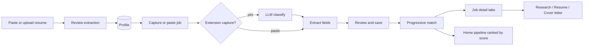

# Project Status

Last updated: 2026-07-31

## Where we are

AI Career OS has a working **resume → job → explainable match → act** loop with **web-grounded company research**, **pgvector RAG**, and a **Chrome extension MVP** for job capture. The product direction is **extension-first**: source-agnostic DOM capture (never fetch job URLs), side panel for the full app, paste resume as primary onboarding.

**Current milestone:** M8 complete — [memory + feedback loop](milestones/m8-memory-feedback.md). M7 extension capture remains the primary intake surface.

## Product flow (today)

1. **Onboarding** — paste or PDF → LLM structured extraction → human review → save profile.
2. **Add job** — extension capture (classify → extract) or paste → **review step** → save with automatic match (`profile_id`).
3. **Progressive match** — fast screen score while pending; full strengths/gaps when complete.
4. **Job detail** — tabbed tools after full analysis: match, company research, resume optimization, cover letter.
5. **Company research** — bounded agent loop (search or synthesize) → DuckDuckGo → source-grounded brief.
6. **Home pipeline** — jobs ranked by match score with live polling.

## Implemented

| Area | Status |
|------|--------|
| Resume PDF extraction + structured `ResumeExtraction` | Done |
| Paste resume intake (`POST /profiles/parse-text`) | Done |
| Profile CRUD + settings (BYOM: cloud + local) | Done |
| Job intake wizard (paste → review → save) | Done |
| Job capture classification (`POST /jobs/classify-capture`) | Done |
| Source-agnostic extension DOM capture (no per-site extractors) | Done |
| Explainable match + match on job insert | Done |
| Progressive match (screen → full at intake) | Done |
| Job detail tabs (match / research / resume / cover letter) | Done |
| Resume optimization (gap → suggestions → apply) | Done |
| Cover letter (draft → critique → revise, max 400 chars) | Done |
| Company research (bounded agent + web search + brief) | Done |
| Light-theme UI, sidebar nav, AI loading states | Done |
| Home job pipeline with polling | Done |
| Eval harness (8 suites) | Done |
| LLM + tool + agent step tracing | Done |
| Screening card + `match_summary` at job extract | Done |

## API surface (`/api/v1/`)

| Resource | Key endpoints |
|----------|----------------|
| Profiles | CRUD, `POST /profiles/parse-resume`, `POST /profiles/parse-text`, `GET /profiles/{id}/resume.pdf` |
| Jobs | CRUD, `POST /jobs/classify-capture`, `POST /jobs/parse-text`, `POST /jobs` (progressive match), `POST /jobs/{id}/company-research` |
| Match analyses | `POST /match-analyses` (manual re-analyze), list, get |
| Match actions | `POST /match-analyses/{id}/resume-optimization`, `POST /match-analyses/{id}/cover-letter` |
| Settings | GET/PUT LLM provider config |
| LLM | `POST /llm/models` |

Interactive docs: http://127.0.0.1:8000/docs

## What's next (M7+)

| Priority | Milestone | Why |
|----------|-----------|-----|
| **Now** | [M7 — Chrome extension](extension.md) polish | Source-agnostic capture, side panel as main UI |
| Next | Re-analyze on job update | JD edits should refresh match |
| Soon | Tavily/Serper search in settings | Production-grade search |
| Soon | Company brief → cover letter context | Richer outreach |
| Cleanup | Prune unused batch/cascade backend | Done (Phase 1 refactor) |

## Intentionally deferred

- Authentication (single-user local dev)
- Vector DB / RAG at scale — pgvector cache shipped; further scale TBD
- Fetching job URLs (extension or backend) — [DOM-only capture](extension.md)
- Per-site / per-ATS DOM extractors or heuristic job-page detection
- Agent frameworks (LangChain, ReAct) — bounded Python loops only
- Auto-apply

## References

- [AI engineering patterns](ai-engineering.md)
- [M6: Company research](milestones/m6-company-research.md)
- [Architecture](architecture.md)
- [Milestones](milestones/README.md)
